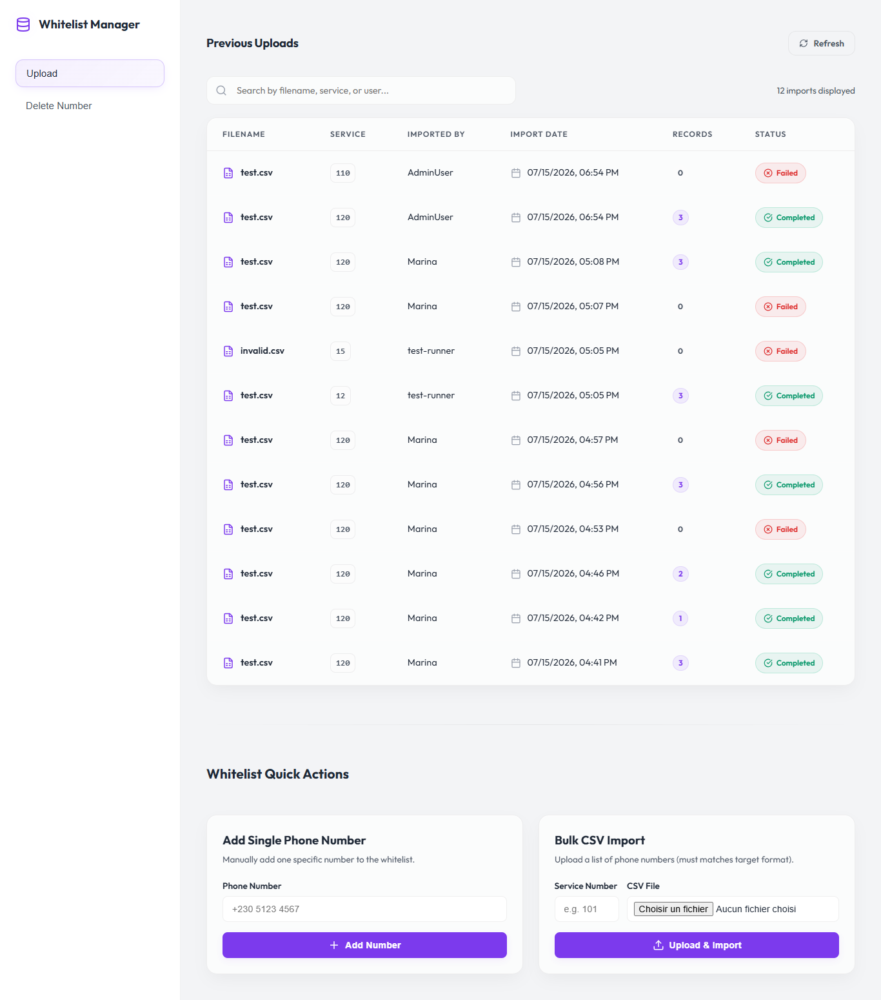
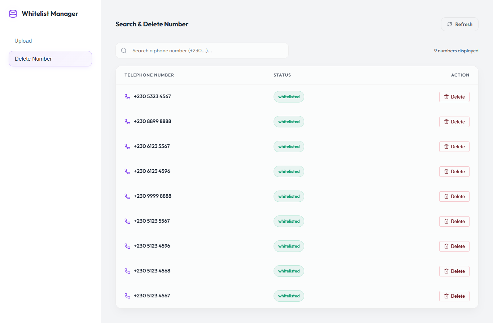

# 📋 Whitelist Management

A full-stack application for managing a phone number whitelist. Allows adding, removing, and bulk importing numbers via CSV files, with full traceability through audit logs and import history tracking.

---

## 📸 Application Preview

### Page — CSV Import History


### Page — Whitelisted Numbers List


---

## 🗂️ Project Structure

```
whitelist-management/
├── backend/              # Node.js / Express server
│   └── src/
│       ├── app.js
│       ├── config/       # MSSQL database connection
│       ├── routes/       # API endpoint definitions
│       ├── controllers/  # HTTP request handling
│       ├── services/     # Business logic & orchestration
│       ├── repositories/ # Data access layer (SQL)
│       ├── middleware/   # File upload handling (Multer)
│       └── utils/        # Phone number validation
├── frontend/             # React application (Vite)
│   └── src/
│       ├── api/          # Centralized HTTP client (fetch)
│       ├── components/
│       │   ├── Layout/   # Sidebar & Header
│       │   ├── Import/   # Import history table
│       │   └── Whitelist/# Whitelist table
│       ├── styles/       # CSS variables & design system
│       └── App.jsx       # Main application assembly
├── database/
│   └── schemas.sql       # MSSQL table creation script
└── screenshots/          # UI screenshots
```

---

## 🛠️ Tech Stack

| Layer        | Technology                          |
|--------------|-------------------------------------|
| Backend      | Node.js, Express.js                 |
| Database     | Microsoft SQL Server (MSSQL)        |
| Driver       | `mssql` (connection pooling)        |
| File Upload  | Multer                              |
| CSV Parsing  | fast-csv                            |
| Frontend     | React 19, Vite 8                    |
| Icons        | lucide-react                        |
| Styling      | Vanilla CSS (Glassmorphism, Dark Mode) |

---

## 🗄️ Database Schema

Three MSSQL tables are used:

| Table            | Description                                             |
|------------------|---------------------------------------------------------|
| `Whitelist`      | Authorized phone numbers                                |
| `AuditLogs`      | History of individual actions (add / remove)            |
| `ImportHistory`  | Tracking of each CSV import (status, date, count, etc.) |

---

## 🔌 REST API — Endpoints

Base URL: `http://localhost:5000/api/whitelist`

| Method   | Route       | Description                                            |
|----------|-------------|--------------------------------------------------------|
| `POST`   | `/add`      | Add a single phone number to the whitelist             |
| `DELETE` | `/remove`   | Remove a phone number from the whitelist               |
| `POST`   | `/import`   | Bulk import a CSV file (strict "All or Nothing" logic) |
| `GET`    | `/imports`  | Retrieve the CSV import history                        |
| `GET`    | `/list`     | Retrieve all whitelisted phone numbers                 |

### Expected phone number format
```
+230 5123 4567
```
*(Country code + space + 4 digits + space + 4 digits)*

---

## ⚙️ Installation & Setup

### Prerequisites
- Node.js ≥ 18
- Microsoft SQL Server (or SQL Server Express)

### 1. Database

Create the database and run the schema script:
```sql
-- From SSMS or sqlcmd
USE WhitelistDB;
-- Run database/schemas.sql
```

### 2. Backend

```bash
cd backend

# Configure environment variables
cp .env.example .env
# Fill in DB_USER, DB_PASSWORD, DB_SERVER, DB_DATABASE, DB_PORT

# Install dependencies
npm install

# Start the server (port 5000)
npm run dev
```

The server will output:
```
🚀 Server started on port 5000
✅ Successfully connected to the MSSQL database!
```

### 3. Frontend

```bash
cd frontend

# Install dependencies
npm install

# Start the development server (port 5173)
npm run dev
```

Open `http://localhost:5173` in your browser.

---

## 📦 Backend Environment Variables (`.env`)

```env
PORT=5000
DB_USER=sa
DB_PASSWORD=your_password
DB_SERVER=localhost
DB_INSTANCE=SQLEXPRESS
DB_DATABASE=WhitelistDB
DB_PORT=1433
```

---

## ✨ Features

- ✅ **Single entry add** — Add one number with automatic audit log
- ✅ **Single entry remove** — Remove a number with full traceability
- ✅ **Bulk CSV import** — Strict "All or Nothing" validation: if any single line is invalid, no numbers are inserted
- ✅ **Duplicate detection** — Within the CSV file and against the database
- ✅ **Import history** — Status tracking (`completed`, `failed`, `pending`) and inserted row count per import
- ✅ **Whitelist viewer** — Filterable and searchable list of all authorized numbers
- ✅ **Modular architecture** — Routes / Controllers / Services / Repositories / Middlewares / Utils
- ✅ **Premium UI** — Dark mode, Glassmorphism, smooth animations

---

## 🏗️ Backend Architecture

The backend follows the **MVC + Service Layer + Repository Pattern**:

```
HTTP Request
    ↓
  Router         → Route binding
    ↓
  Controller     → Parameter extraction, HTTP response formatting
    ↓
  Service        → Business logic, validation, SQL transaction orchestration
    ↓
  Repository     → Direct SQL queries on MSSQL tables
```